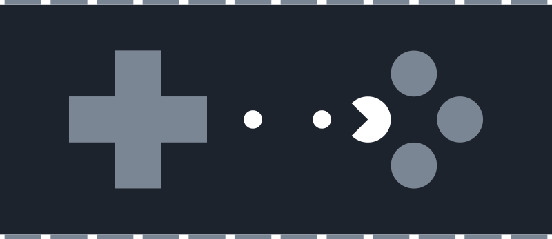

# APHGames Web

<p align="center">
    
</p>

- 🎓 wiki, slides, and examples
- 📦 built on top of [docusaurus library](https://docusaurus.io/)


## Project Structure

```
project
│   │   blog                // place for a blog... not used right now
│   │   docs                // markdown documents with instructions, tutorials, guides etc.
│   │   plugins             // some plugins
│   │   src                 // React sources with custom components and themes
│   │   static              // static files (slides and examples are downloaded into this folder) 
│   │   types               // additional Typescript declarations
│
│   CHANGELOG.md            // changelog
│   package.json            // npm scripts and dependencies
│   README.md               // README file
│   tsconfig.json           // typescript config (only for pre-build)
│   tslint.json             // typescript linter settings for static checking
```

## How to build this project
- clone it
- install [nodeJS](https://nodejs.org/en/download/), LTS version if possible 
- execute `npm install`
- download external assets (slides and examples) by running `npm run download_data`
- run `npm start_en` to run the English version, or `npm start_cs` to run the Czech version
- navigate to `localhost:3000`

## What is not included in this repository
- gallery of past projects (they are maintained separately by the contributors)
- slides - they are in a [separate repo](https://github.com/APHGames/slides)
- examples - they are in a [separate repo](https://github.com/APHGames/examples)


Changelog is available [here](./CHANGELOG.md)

## Deployment

- the current EN version is deployed on [aphgames.io](https://aphgames.io)
- the current CZ version is deployed on [aphgames.cz](https://aphgames.cz)