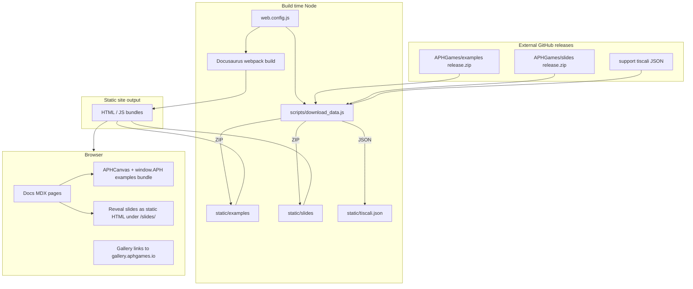

# APHGames Web — Product / architecture description

This document describes how **aphgames-web** (package name `aphgames-web`) is structured, what it ships at runtime, and how it connects to external repositories and services. It is aimed at engineers and coding agents onboarding onto the project.

---

## 1. Purpose and scope

The site is a **static documentation and teaching hub** for APHGames: learning materials (Markdown/MDX), **embedded interactive examples** (canvas games/demos), **Reveal.js HTML slides**, course pointers, a **student project gallery**, a Czech-only **YouTube video catalog**, and ancillary pages (e.g. Czech-only curated links). There is **no application server** in this repo; production is static files (typically hosted behind a CDN or static host). Build-time Node scripts fetch large binary artifacts; the running site only needs those files under `static/`.

---

## 2. Technology stack

| Area | Choice |
|------|--------|
| Framework | [Docusaurus](https://docusaurus.io/) **2.0.0-beta.17** (`@docusaurus/core`, `@docusaurus/preset-classic`) |
| UI | React **17**, MDX v1 (`@mdx-js/react`) |
| Styling | Global SCSS (`docusaurus-plugin-sass`, `src/css/global.scss`) + CSS modules for pages |
| Search | **Vendored** `@cmfcmf/docusaurus-search-local` under `plugins/docusaurus-search-local` (Lunr-based local search) |
| TypeScript | Used for authoring `src/` and some docs; Docusaurus does not rely on `tsc` for its main build (see `tsconfig.json` comment) |
| Tooling | ESLint (Airbnb), `fork-ts-checker-webpack-plugin` in dev |

**Important:** Locale and site URL are chosen **at config load time** from the CLI (`--locale`), not from Docusaurus’s multi-locale runtime. Each production language is effectively a **separate build** (see §5).

---

## 3. High-level architecture

- **Docusaurus** turns `docs/`, `blog/`, `src/pages/`, and theme overrides into a SPA + static assets.
- **`download_data`** pulls **versioned release ZIPs** for examples and slides (URLs and versions live in `web.config.js`), plus a filtered JSON dump for the Czech “artifacts” page.
- **Examples** ship as a prebuilt JS bundle consumed in the browser (`static/examples/`); they are **not** compiled from this repo’s TypeScript sources.
- **Slides** ship as static **Reveal.js** HTML, icons, and `slides-info.json`; listing UIs read that JSON and link to `/slides/*.html`.

---

## 4. Repository layout (essentials)

| Path | Role |
|------|------|
| `docusaurus.config.js` | Main Docusaurus config; merges `web.config.js` into `customFields`; wires plugins, navbar, i18n **single-locale** mode, docs sidebar generator hook |
| `web.config.js` | Domains, GitHub URLs, **examples** / **slides** release coordinates, `gallery_url`, `tiscali_url` |
| `sidebars.js` | Single autogenerated sidebar: `tutorialSidebar` → `docs/learning` |
| `docs/` | Primary Markdown/MDX content (`learning/`, `courses/`, `brand.md`, …) |
| `i18n/cs/`, `i18n/en/` | Per-locale strings (`code.json`, `news.json`), **translated doc copies** under `docusaurus-plugin-content-docs/current/`, and locale-specific React (`components/About.tsx`) |
| `src/pages/` | Custom pages: home (`index.tsx`), `gallery.tsx`, Czech `videos.tsx` / `artifacts.tsx`, **Events** (`events/`) |
| `src/APHCanvas.tsx` | Bridge from MDX to the **examples** bundle (`window.APH[name]`) |
| `src/theme/` | Swizzled theme pieces (`DocPaginator`, `NavbarItem/NavbarNavLink`) |
| `src/css/` | Global SCSS plus CSS modules. Shared page primitives live in `layout.module.scss` (section, feature tiles, about panels); page-specific modules (`home`, `events`, `gallery`, …) compose on top |
| `src/components/` | Shared UI: `HeroParallax`, Events widgets, loading spinner |
| `src/internals/` | Data modules (`gallery-data.ts`, `videos-data.ts`, `resources-data.ts`, `events/`, Prism themes, …) |
| `static/` | Images and other static assets; **`examples/`, `slides/`, `tiscali.json` are gitignored** and produced by `download_data`. Event photos/logos under `static/img/pages/events/` **are committed** |
| `plugins/docusaurus-search-local/` | Local search plugin copy |
| `scripts/download_data.js` | Downloads and extracts external ZIPs + JSON |

---

## 5. Internationalization (Czech / English)

### 5.1 Two sites, two builds

- `web.config.js` defines `urls.cs` and `urls.en` (e.g. aphgames.cz vs aphgames.io).
- `docusaurus.config.js` reads `process.argv` for `--locale` and sets:
  - `i18n.defaultLocale` and `i18n.locales` to **only that locale** (the other language is on another domain, not bundled as a second locale in one artifact).
- NPM scripts mirror this: `start_cs` / `build_cs` / `deploy_cs` vs `start_en` / `build_en` / `deploy_en`.

### 5.2 Translations

- Navbar labels, keywords, and many UI strings come from `i18n/<locale>/code.json`.
- Home page news is loaded from `i18n/<locale>/news.json`.
- The **About** block on the home page is loaded via `react-loadable` from `i18n/<locale>/components/About.tsx` (so copy/layout can diverge per language).
- Events chrome (navbar **Events / Akce**, subnav, hub tiles) uses `code.json`. Event body copy is currently Czech in `src/internals/events/` on both locale builds.

### 5.3 Docs per locale and “Czech-only” pages

- Canonical English docs live under `docs/`.
- Czech overrides live under `i18n/cs/docusaurus-plugin-content-docs/current/` (mirrored paths).
- **Per-doc language gating:** `sidebarItemsGenerator` in `docusaurus.config.js` filters out docs whose front matter includes `exclude_cs` or `exclude_en` for the active build. Examples in tree: `docs/courses/aph.md` and `docs/learning/03-aph-requirements.md` use `exclude_en: true` (Czech-oriented course material).

### 5.4 Czech-only UI

- Navbar injects **Videa**, **Artifacts**, and a **YouTube** icon link only when `currentLocale === 'cs'` (`docusaurus.config.js`).
- Home portal tile **Videa** is Czech-only and points to `/videos` (not directly to YouTube).
- `src/pages/videos.tsx` catalogues the APHGames YouTube channel; English builds redirect `/videos` to `/`.
- `src/pages/artifacts.tsx` is a Czech-facing page backed by `static/tiscali.json`.

---

## 6. Content model (docs)

- **Sidebar:** `sidebars.js` autogenerates from folder `docs/learning` only. Other doc routes (e.g. `docs/courses/`, `docs/brand.md`) are reached via explicit links/nav, not the main tutorial sidebar.
- **MDX:** Docs can import React/TSX modules (e.g. `@site/docs/learning/lectures.tsx`, `@site/src/APHCanvas.tsx`).
- **Intro + slides index:** `docs/learning/01-intro.md` embeds `<Lectures />` from `docs/learning/lectures.tsx`, which reads `static/slides/slides-info.json` and groups slides for the **current locale**, excluding course-tagged rows (`!sl.course`).
- **Course slides:** `docs/courses/aph.md` embeds `docs/courses/aph_lectures.tsx`, filtering `slides-info.json` for `locale` match and `course === 'APH'`, with optional **locked** tiles (`locked === 'true'` string from JSON).

---

## 7. External project: engine examples (GitHub `APHGames/examples`)

### 7.1 What this repo contains

- Not the TypeScript sources. At build/dev time, `npm run download_data` downloads `release.zip` from the configured GitHub **releases** asset and extracts it to **`static/examples/`** (ignored by git).

### 7.2 How the site loads them

- `src/APHCanvas.tsx` runs only in the browser (`typeof window !== 'undefined'`).
- On first use it sets `window.BASE_URL` to the site-absolute `/examples` path and injects `static/examples/examples.js` as a classic `<script>` (not a webpack `require`). Webpack wrapping the Parcel bundle in strict mode broke its embedded `punycode.toASCII` and crashed any demo that loads assets.
- It instantiates `new window.APH[name](config)`, calls `.init(canvasDomElement)`, and `.destroy()` on unmount.
- MDX pages pass a string **`name`** matching an exported example class (e.g. `<APHCanvas name={'Tetris'} />`).

### 7.3 Relation to COLF.io / Pixi

- The examples bundle is built from the **examples** repository; those demos are described in copy as using **COLF.io** (minigame layer on **PixiJS**). This site documents and embeds them; it does not list `colf.io` as an npm dependency.

### 7.4 Updating examples

- Bump `examples_version` in `web.config.js` to match a published **APHGames/examples** release, then rerun `npm run download_data`.

---

## 8. External project: slides (GitHub `APHGames/slides`, Reveal.js)

### 8.1 What this repo contains

- ZIP extracted to **`static/slides/`**: HTML decks (e.g. `tutorial_….html`), `slides-info.json`, `icons/`, assets. Path is gitignored.

### 8.2 How the site surfaces them

- **Direct static URLs:** `/slides/<file_name>.html` with query variants `?print-pdf` and `?presentation` (Reveal.js conventions).
- **Discovery UI:** `lectures.tsx` (general) and `aph_lectures.tsx` (APH course) render cards from `slides-info.json` (`group`, `name`, `file_name`, `locale`, `category`, `course`, `locked`, …).

### 8.3 User documentation

- `docs/learning/misc/slides.md` documents Reveal keyboard shortcuts and expectations.

### 8.4 Updating slides

- Bump `slides_version` in `web.config.js`, run `npm run download_data`.

---

## 9. Gallery (`/gallery`)

- Implemented in `src/pages/gallery.tsx` with data from `src/internals/gallery-data.ts`.
- Game tiles link to **`gallery_url`** from `web.config.js` (e.g. `https://gallery.aphgames.io`) with paths like `{galleryUrl}/{item.id}/`; screenshots are expected at `{galleryUrl}/{item.id}/screenshot.jpg`.
- The gallery is **not** stored in this repo; this project only links out.

---

## 10. Events (`/events`)

Navbar **Events** / **Akce** is a dropdown (**GameHack FIT**, **GameJam FIT**) on both locales. Pages live under `src/pages/events/` and are **not** in the learning sidebar. `/events` remains a hub page but is not listed in the navbar.

| Route | Role |
|------|------|
| `/events` | Hub with two feature tiles |
| `/events/gamehack` | GameHack FIT, 17–19 Nov 2023 (landing, programme, trailer, sponsors) |
| `/events/gamehack/rules`, `/events/gamehack/faq` | That event’s rules and FAQ |
| `/events/gamejam` | Easter GameJam 7–9 Apr 2023 landing |
| `/events/gamejam/rules`, `/events/gamejam/faq` | Series rules and FAQ |
| `/events/gamejam/archive` | Past jams (2022.2, 2022.1, 2020) plus YouTube recaps |

Copy, programmes, FAQ/rules, and archive cards live in `src/internals/events/`. Images are committed under `static/img/pages/events/{gamehack,gamejam}/` (parallax, logos, gallery JPEGs). They are **not** fetched by `download_data`.

Widgets (`EventHero`, programme grid, FAQ/rules panels, photo looper, game cards) use `src/css/layout.module.scss` plus `src/css/events.module.scss`. `/gallery` remains the student-project gallery.

---

## 10.5 Videos (`/videos`, Czech only)

- Data: `src/internals/videos-data.ts` (YouTube ids, titles, short Czech blurbs, duration in seconds).
- Page: `src/pages/videos.tsx` — five sections: streamed lectures, examples/tutorials, series *Jak se holky dostaly k počítačovým hrám*, art videos, GameJam/GameHack recaps.
- Thumbnails load from `i.ytimg.com`; playback is an on-demand YouTube embed (one video at a time).
- English locale redirects `/videos` home; the page is not in the English navbar.

---

## 11. Search plugin (local fork)

- Configured in `docusaurus.config.js` as a **file path** plugin: `plugins/docusaurus-search-local`.
- Indexes docs, blog, and pages; Lunr `language` is set to `["en", "ru"]` where **Russian is used as a stand-in tokenizer config for Czech** (comment in config: cs not supported out of the box).
- `style: undefined` avoids injecting default plugin CSS (custom styling expected elsewhere).

---

## 12. Theme and UX customizations

- **`DocPaginator`:** swizzled to render `null` — prev/next doc footer navigation is disabled site-wide.
- **`NavbarNavLink`:** small customization around `Link` / active class behavior.
- **Color mode:** default dark, **switch disabled** (comment: avoiding maintaining two diagram themes).
- **Layout primitives:** `src/css/layout.module.scss` holds shared section/tile/panel classes used by home, About, and Events. Page modules add only local chrome.
- **Prism:** custom light/dark themes under `src/internals/prism-aph-*.js`.

---

## 13. Build, run, deploy

### 13.1 Typical developer flow

1. `npm install`
2. `npm run download_data` — downloads examples ZIP, slides ZIP, and `tiscali.json` (Node 18+ built-in `http`/`https`).
3. `npm run start_en` or `npm run start_cs` — Docusaurus dev server.

### 13.2 Production build

- `npm run build_en` / `npm run build_cs` — outputs under `build/` (gitignored).

### 13.3 Deploy

- `docusaurus deploy` scripts exist per locale; hosting is static (see README: aphgames.io / aphgames.cz).

### 13.4 Lint

- `npm run lint` targets `src`, `i18n`, `docs`.

---

## 14. Configuration reference (`web.config.js`)

| Field | Purpose |
|-------|---------|
| `urls.cs` / `urls.en` | Canonical site origins per language build |
| `owner`, `org` | Branding / copyright |
| `github`, `youtube` | External links (navbar) |
| `examples_url`, `examples_version` | GitHub repo + release tag for examples ZIP |
| `slides_url`, `slides_version` | GitHub repo + release tag for slides ZIP |
| `gallery_url` | Base URL for hosted student games |
| `tiscali_url` | JSON for artifacts page |

All of the above are spread into Docusaurus `siteConfig.customFields` for use in React (`useDocusaurusContext`).

---

## 15. Risks and upgrade notes (for maintainers)

- **Docusaurus beta.17** is dated; upgrading will touch webpack, MDX, i18n, and the swizzled theme APIs.
- **`APHCanvas`** depends on globals and a **Parcel-style** examples bundle; changing the examples build output may require edits to `BASE_URL`, `require` path, or constructor names.
- **`download_data`** uses `SSL_VERIFYPEER: false` — acceptable only in a trusted controlled environment; revisit for CI security policy.
- **Course / intro links** in navbar point to `/docs/learning/intro`; the on-disk intro file is `docs/learning/01-intro.md` — confirm URL aliases or fix links when changing doc slugs.

---

## 16. Glossary

| Term | Meaning here |
|------|----------------|
| **Examples** | Prebuilt JS bundle from **APHGames/examples**, embedded via `APHCanvas` |
| **Slides** | Reveal.js HTML decks from **APHGames/slides**, served as static files |
| **COLF.io** | External engine/library used by examples and gallery Pixi titles (documented, not vendored as source in this repo) |
| **`customFields`** | `web.config.js` merged into Docusaurus config for runtime access |

---

*Document generated to reflect the repository as of the project state when authored. When in doubt, treat `docusaurus.config.js`, `web.config.js`, and `scripts/download_data.js` as the source of truth for wiring and versions.*
